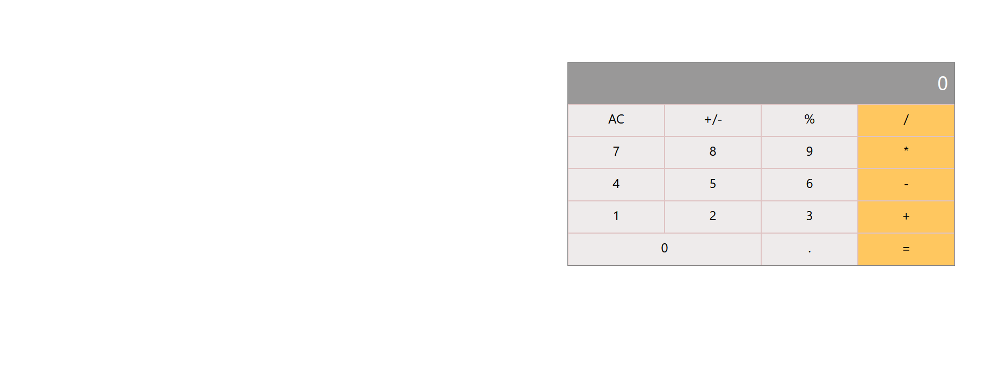

# Math magicians

"Math magicians" is a website for all fans of mathematics. It is a Single Page App (SPA) that allows users to:

  - Make simple calculations.
  - Read a random math-related quote.

  
  
  This project has three pages which utilise the react router and implements testing using jest, and the react-testing-library

## Built With

- React

## Getting Started

To get a local copy up and running follow these simple example steps.
- Clone the repository with:
`git clone https://github.com/blakbox23/math-magicians.git`

- Install dependencies by running:
`npm install`

### Usage
To run the app in your machine, run `npm start`

### Testing
To run tests, run `npm run test`

## Authors

👤 **Peter Mbuthia**

- GitHub: [@Blakbox23](https://github.com/blakbox23)
- Twitter: [@blakbox23](https://twitter.com/blakbox23)
- LinkedIn: [Peter Mbuthia](https://www.linkedin.com/in/peter-mbuthia)

## 🤝 Contributing

Contributions, issues, and feature requests are welcome!

Feel free to check the [issues page](https://github.com/blakbox23/math-magicians/issues).

## Show your support

Give a ⭐️ if you like this project!

## Acknowledgments

- Hat tip to anyone whose code was used
- Inspiration
- etc

## 📝 License

This project is [MIT](./MIT.md) licensed.
